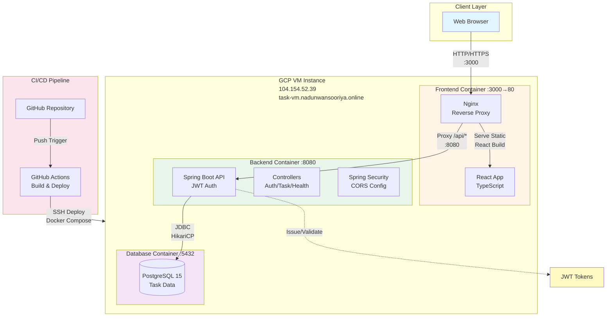
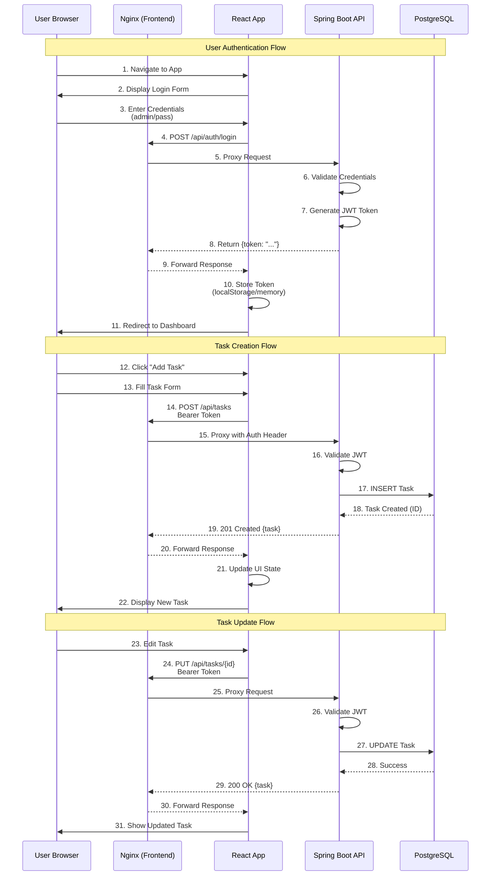
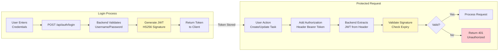
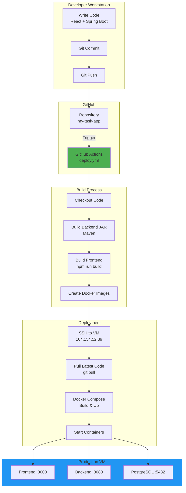
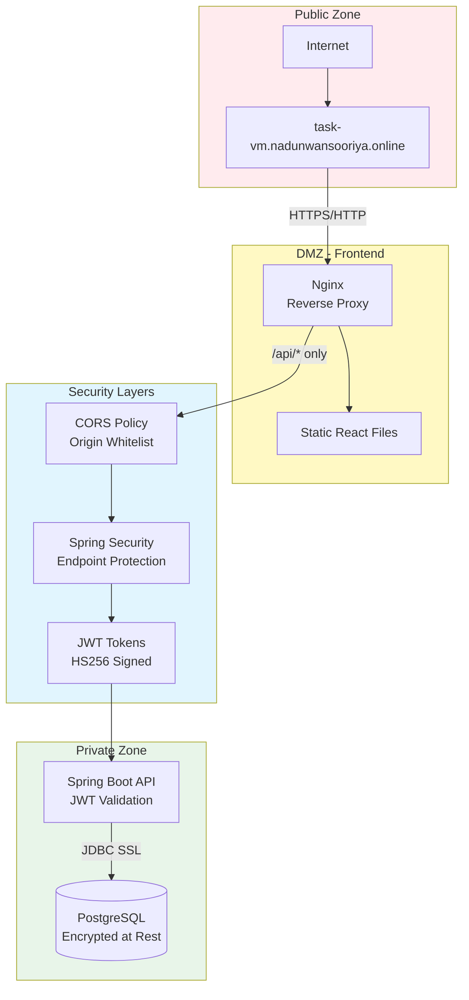
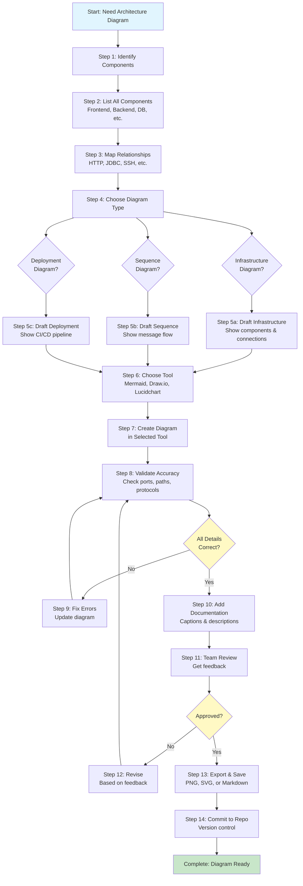

# Architecture Documentation
## Task Management Application

**Project:** my-task-app  
**Version:** 1.0  
**Last Updated:** November 2025

---

## Table of Contents
1. [System Overview](#system-overview)
2. [High-Level Architecture](#high-level-architecture)
3. [Request Flow](#request-flow)
4. [Authentication Flow](#authentication-flow)
5. [Deployment Architecture](#deployment-architecture)
6. [Component Details](#component-details)
7. [Network & Ports](#network--ports)
8. [Security Architecture](#security-architecture)
9. [GKE Deployment Report (Final)](#gke-deployment-report-final)
    - [Resources](#resources)
    - [Technologies Used](#technologies-used)
    - [GKE Architecture Overview](#gke-architecture-overview)
    - [CI/CD Pipeline (Code Deployment)](#cicd-pipeline-code-deployment)
    - [Application Architecture (Cloud Runtime)](#application-architecture-cloud-runtime)
    - [Flows](#flows)
    - [Monitoring Setup](#monitoring-setup)
    - [Risks and Recommendations](#risks-and-recommendations)
    - [GKE Diagram](#gke-diagram)

---

## System Overview

This is a full-stack task management application built with React, Spring Boot, and PostgreSQL, deployed on GCP VM with automated CI/CD.

**Technology Stack:**
- **Frontend:** React 19 + TypeScript + Material-UI + Nginx
- **Backend:** Spring Boot 3.5.7 + Java 17 + JWT Authentication
- **Database:** PostgreSQL 15
- **Infrastructure:** Docker + Docker Compose
- **CI/CD:** GitHub Actions
- **Cloud:** Google Cloud Platform (GCP)

**Access Points:**
- **IP Access:** http://104.154.52.39:3000
- **Domain Access:** https://task-vm.nadunwansooriya.online

---

## High-Level Architecture



---

## Request Flow

### Task CRUD Operation Flow



---

## Authentication Flow



---

## Deployment Architecture



---

## Component Details

### Frontend Container
- **Technology:** React 19 + TypeScript
- **Styling:** Material-UI v5
- **HTTP Client:** Axios
- **Server:** Nginx (serves static files + reverse proxy)
- **Build:** Multi-stage Docker build
- **Port:** External 3000 → Internal 80
- **Key Files:**
  - `src/App.tsx` - Main application component
  - `src/TaskList.tsx` - Task management UI
  - `src/Login.tsx` - Authentication UI
  - `src/config.ts` - Dynamic API URL detection
  - `nginx.conf` - Proxy configuration

**Nginx Proxy Rules:**
```
/ → React static files
/api/* → http://backend:8080
```

### Backend Container
- **Framework:** Spring Boot 3.5.7
- **Language:** Java 17
- **Build Tool:** Maven 3.9
- **Authentication:** JWT (jjwt 0.12.6)
- **Security:** Spring Security + Custom CORS
- **Port:** 8080
- **Key Components:**
  - `AuthController` - Login/Register endpoints
  - `TaskController` - CRUD operations
  - `HealthController` - System health checks
  - `JwtUtil` - Token generation/validation
  - `SecurityConfig` - Security rules
  - `WebConfig` - CORS configuration

**API Endpoints:**
```
POST   /api/auth/login      - User login
POST   /api/auth/register   - User registration
GET    /api/tasks           - List all tasks
POST   /api/tasks           - Create task
PUT    /api/tasks/{id}      - Update task
DELETE /api/tasks/{id}      - Delete task
GET    /api/tasks/analytics - Task statistics
GET    /health              - Health check
```

### Database Container
- **Database:** PostgreSQL 15-alpine
- **Connection Pool:** HikariCP
- **Port:** 5432 (internal)
- **Initialization:** init-db.sql
- **Schema:**
  - Tasks table (id, title, description, due_date, priority, category, completed, created_at, updated_at)
  - User authentication (demo/hardcoded)

---

## Network & Ports

### External Access
| Service | Protocol | Port | URL |
|---------|----------|------|-----|
| Frontend | HTTP | 3000 | http://104.154.52.39:3000 |
| Frontend | HTTPS | 443 | https://task-vm.nadunwansooriya.online |

### Internal Container Network
| Container | Port | Purpose |
|-----------|------|---------|
| frontend | 80 | Nginx serves React + proxies API |
| backend | 8080 | Spring Boot REST API |
| postgres | 5432 | PostgreSQL database |

### Port Mapping
```
Host :3000 → Frontend Container :80
Frontend :80 → Backend :8080 (internal proxy)
Backend :8080 → Postgres :5432 (internal JDBC)
```

---

## Security Architecture



### Security Features
1. **Authentication:** JWT-based stateless authentication
2. **Authorization:** Protected endpoints require valid Bearer token
3. **CORS:** Configured for specific origins (domain + IP)
4. **Transport:** HTTPS for domain access
5. **Database:** Connection pooling limits exposure
6. **API Gateway:** Nginx filters and proxies requests
7. **Container Isolation:** Separate containers for each service

### Security Configuration
- **JWT Expiration:** Configurable (default recommended: 24 hours)
- **CORS Origins:** Wildcard patterns for development, specific for production
- **Public Endpoints:** `/`, `/api/auth/**`, `/health`, `/error`
- **Protected Endpoints:** `/api/tasks/**` (requires JWT)

---

## Data Flow Summary

1. **User Request** → Browser sends HTTP/HTTPS request
2. **Nginx Receipt** → Receives on port 3000 (external) / 80 (internal)
3. **Routing Decision:**
   - Static files (React) → Serve directly
   - API calls (/api/*) → Proxy to backend:8080
4. **Backend Processing** → Spring Boot validates JWT, processes request
5. **Database Operation** → Execute SQL via HikariCP connection pool
6. **Response Chain** → DB → Backend → Nginx → Browser

---

## Technology Decisions

| Aspect | Technology | Rationale |
|--------|------------|-----------|
| Frontend Framework | React 19 | Modern, component-based, large ecosystem |
| Type Safety | TypeScript | Catch errors at compile time |
| Backend Framework | Spring Boot | Enterprise-grade, comprehensive features |
| Language | Java 17 | LTS, mature, performant |
| Database | PostgreSQL | ACID compliance, reliability, open-source |
| Authentication | JWT | Stateless, scalable, industry standard |
| Containerization | Docker | Consistency across environments |
| Orchestration | Docker Compose | Simple multi-container management |
| CI/CD | GitHub Actions | Integrated with repository, free tier |
| Cloud Provider | GCP | Cost-effective, reliable infrastructure |
| Reverse Proxy | Nginx | High performance, battle-tested |

---

## Scaling Considerations

### Current Architecture (Single VM)
- Suitable for: 100-1000 concurrent users
- Bottlenecks: Single point of failure, limited resources

### Future Scaling Path

**Horizontal Scaling:**
1. Load Balancer → Multiple Frontend Containers
2. API Gateway → Multiple Backend Instances
3. Database → Read Replicas + Master-Slave
4. Session Management → Redis for distributed sessions

**Vertical Scaling:**
1. Increase VM size (CPU, RAM)
2. Database connection pool tuning
3. JVM heap size optimization

**Infrastructure Evolution:**
```
Current: Single VM with Docker Compose
↓
Next: Multiple VMs with Load Balancer
↓
Future: Kubernetes Cluster
↓
Enterprise: Multi-Region with CDN
```

---

## Monitoring & Observability

**Current Health Checks:**
- `/health` endpoint for backend status
- Docker container health checks
- Database connection validation

**Recommended Additions:**
1. **Metrics:** Prometheus + Grafana
2. **Logging:** ELK Stack (Elasticsearch, Logstash, Kibana)
3. **Tracing:** Jaeger or Zipkin
4. **Alerts:** PagerDuty or Opsgenie
5. **Uptime:** Pingdom or UptimeRobot

---

## Version History

| Version | Date | Changes |
|---------|------|---------|
| 1.0 | Nov 2025 | Initial architecture with React, Spring Boot, PostgreSQL |
| - | - | JWT authentication implemented |
| - | - | Docker Compose orchestration |
| - | - | GitHub Actions CI/CD |
| - | - | Domain and IP dual access |
| - | - | Nginx reverse proxy configuration |

---

## References

- **Repository:** https://github.com/NadunWansooriya1/my-task-app
- **Frontend Docs:** `todo-frontend/README.md`
- **Backend Docs:** `todo-api/README.md`
- **Deployment Guide:** `DEPLOYMENT_GUIDE.md`
- **Setup Guide:** `SETUP_GUIDE.md`

---

## How to Create Architecture Diagrams

### Diagram Creation Workflow



---

## Step-by-Step Guide to Creating Architecture Diagrams

### Phase 1: Planning & Preparation

#### Step 1: Identify System Components
- List all major components in your system
- For this project:
  - ✅ Web Browser (Client)
  - ✅ Frontend Container (React + Nginx)
  - ✅ Backend Container (Spring Boot)
  - ✅ Database Container (PostgreSQL)
  - ✅ VM Host (GCP)
  - ✅ CI/CD Pipeline (GitHub Actions)
  - ✅ Authentication System (JWT)

#### Step 2: Document Connections
- Map how components communicate
- Note protocols used:
  - Browser → Nginx: HTTP/HTTPS
  - Nginx → Backend: HTTP (proxy)
  - Backend → Database: JDBC
  - GitHub Actions → VM: SSH
  - Backend ↔ JWT: Token generation/validation

#### Step 3: Gather Technical Details
- Collect port numbers
- Document API paths
- Note data formats
- List security mechanisms

**Example for this project:**
```
Frontend: External 3000 → Internal 80
Backend: 8080
Database: 5432
API Prefix: /api/*
Auth: JWT Bearer tokens
Protocols: HTTP, HTTPS, JDBC, SSH
```

---

### Phase 2: Diagram Type Selection

#### Step 4: Choose Appropriate Diagram Types

**Infrastructure/System Diagram** - Use When:
- Showing overall system architecture
- Displaying component relationships
- Explaining deployment structure
- Presenting to non-technical stakeholders

**Sequence Diagram** - Use When:
- Documenting API flows
- Showing authentication processes
- Explaining request/response cycles
- Debugging interaction issues

**Deployment Diagram** - Use When:
- Documenting CI/CD pipeline
- Showing build and deploy steps
- Explaining environment setup
- Onboarding new developers

**Security Diagram** - Use When:
- Explaining security boundaries
- Showing trust zones
- Documenting authentication flows
- Compliance documentation

---

### Phase 3: Drafting the Diagram

#### Step 5: Create Initial Draft

**For Infrastructure Diagram:**
1. Start with the user/client
2. Add frontend layer
3. Add backend layer
4. Add database layer
5. Group related components
6. Add external systems (CI/CD)
7. Draw arrows showing data flow
8. Label each arrow with protocol/method

**For Sequence Diagram:**
1. List participants left to right
2. Start with user action
3. Show each message as an arrow
4. Number steps sequentially
5. Add notes for complex logic
6. Show return messages (dashed arrows)
7. Include error paths if needed

**For Deployment Diagram:**
1. Start with developer workstation
2. Show code commit/push
3. Add repository
4. Show build pipeline
5. Add deployment steps
6. End with production environment

---

### Phase 4: Tool Selection & Implementation

#### Step 6: Choose Diagramming Tool

**Mermaid (Recommended for this project)**
- ✅ Pros: Text-based, version controlled, renders in GitHub/VS Code
- ✅ Best for: Technical documentation, developer audience
- ❌ Cons: Limited styling options

**Draw.io / diagrams.net**
- ✅ Pros: Visual editor, extensive shapes, export options
- ✅ Best for: Presentations, detailed diagrams
- ❌ Cons: Binary files, harder to version control

**Lucidchart**
- ✅ Pros: Collaborative, professional templates
- ✅ Best for: Team collaboration, stakeholder presentations
- ❌ Cons: Paid, cloud-based

**PlantUML**
- ✅ Pros: Text-based, powerful, many diagram types
- ✅ Best for: Complex diagrams, automation
- ❌ Cons: Steeper learning curve

#### Step 7: Implement the Diagram

**Using Mermaid (Example):**

1. Open your markdown file
2. Add a code block with `mermaid` language tag
3. Start with diagram type (`flowchart`, `sequenceDiagram`, etc.)
4. Add components and relationships
5. Apply styling if needed

**Basic Mermaid Syntax:**
```
flowchart LR
    A[Component A] --> B[Component B]
    B --> C[Component C]
```

---

### Phase 5: Validation & Review

#### Step 8: Validate Technical Accuracy

**Checklist:**
- [ ] All components present
- [ ] Correct port numbers
- [ ] Accurate protocols (HTTP vs HTTPS)
- [ ] API paths correct (/api/*)
- [ ] Security mechanisms shown
- [ ] Data flow direction correct
- [ ] External services included
- [ ] Groupings/boundaries make sense

#### Step 9: Cross-Reference with Code

**Verify Against:**
- `docker-compose.yml` for ports and services
- `nginx.conf` for proxy rules
- `application.properties` for backend config
- `config.ts` for API URLs
- `SecurityConfig.java` for auth rules

#### Step 10: Add Documentation

**For Each Diagram Add:**
- Clear title
- Brief description (1-2 sentences)
- Legend if using colors/symbols
- List of assumptions
- Date created/updated
- Related diagrams references

---

### Phase 6: Review & Approval

#### Step 11: Peer Review

**Review Checklist:**
- Does the diagram accurately represent the system?
- Are all components labeled clearly?
- Is the data flow logical?
- Are technical details correct?
- Is it understandable to the target audience?
- Are there any missing components or connections?

#### Step 12: Incorporate Feedback

**Common Feedback Types:**
- Missing components → Add them
- Unclear labels → Clarify naming
- Wrong protocols → Correct technical details
- Messy layout → Reorganize for clarity
- Too detailed → Simplify for audience
- Too simple → Add necessary details

---

### Phase 7: Finalization & Distribution

#### Step 13: Export Diagrams

**For Mermaid Diagrams:**

Install Mermaid CLI:
```powershell
npm install -g @mermaid-js/mermaid-cli
```

Export to PNG:
```powershell
mmdc -i ARCHITECTURE.md -o architecture-diagrams.png
```

Export to SVG (scalable):
```powershell
mmdc -i ARCHITECTURE.md -o architecture-diagrams.svg
```

Export to PDF:
```powershell
mmdc -i ARCHITECTURE.md -o architecture-diagrams.pdf
```

#### Step 14: Version Control

**Commit to Repository:**
```powershell
git add ARCHITECTURE.md
git commit -m "docs: Add/update architecture diagrams"
git push origin main
```

**Best Practices:**
- Keep diagrams in same repo as code
- Update diagrams when architecture changes
- Use meaningful commit messages
- Tag major architectural changes
- Maintain diagram changelog

---

### Phase 8: Maintenance

#### Step 15: Keep Diagrams Updated

**Update When:**
- Adding new services/components
- Changing deployment strategy
- Modifying authentication flow
- Updating technology stack
- Changing network topology
- Adding/removing integrations

**Maintenance Schedule:**
- Review quarterly
- Update immediately after major changes
- Validate during onboarding sessions
- Check during security audits

---

## Diagram Templates for This Project

### Template 1: Basic Component Diagram
```
User → Frontend → Backend → Database
         ↓           ↑
      [Static]    [API]
```

### Template 2: Detailed Infrastructure
```
[Internet]
    ↓
[Load Balancer - Optional]
    ↓
[Nginx Reverse Proxy]
    ↓           ↓
[React App]  [Spring Boot API]
                ↓
         [PostgreSQL DB]
```

### Template 3: Authentication Flow
```
1. User enters credentials
2. Frontend sends POST /api/auth/login
3. Backend validates credentials
4. Backend generates JWT token
5. Frontend stores token
6. Future requests include Bearer token
7. Backend validates token on each request
```

### Template 4: CI/CD Pipeline
```
Code → Commit → Push → GitHub → Actions → Build → Test → Deploy → VM
```

---

## Quick Reference: Mermaid Syntax

### Flowchart Shapes
```
[Rectangle]         - Standard box
(Rounded)           - Rounded box
([Stadium])         - Stadium shape
[(Database)]        - Database symbol
{Diamond}           - Decision point
((Circle))          - Circle
```

### Arrow Types
```
-->    Solid arrow
-.->   Dotted arrow
==>    Thick arrow
--x    Arrow with cross
--o    Arrow with circle
```

### Subgraphs (Grouping)
```
subgraph Title
    component1
    component2
end
```

### Styling
```
style NodeName fill:#color
```

---

## Common Mistakes to Avoid

1. **Too Much Detail** - Start high-level, add detail only if needed
2. **Inconsistent Naming** - Use same names as in code
3. **Missing Protocols** - Always label connection types
4. **Wrong Direction** - Ensure arrows show actual data flow
5. **Outdated Diagrams** - Update when system changes
6. **No Legend** - Explain colors, symbols, abbreviations
7. **Cluttered Layout** - Use grouping and whitespace
8. **Missing Context** - Add titles and descriptions
9. **Ignoring Audience** - Technical level should match readers
10. **No Version Control** - Keep diagrams in Git with code

---

## Resources & Tools

### Learning Resources
- **Mermaid Documentation:** https://mermaid.js.org/
- **Draw.io Templates:** https://www.diagrams.net/
- **C4 Model:** https://c4model.com/ (architecture diagram standard)
- **AWS Architecture Icons:** https://aws.amazon.com/architecture/icons/

### VS Code Extensions
- **Markdown Preview Mermaid Support** - Render Mermaid in VS Code
- **Draw.io Integration** - Edit Draw.io files in VS Code
- **PlantUML** - Create PlantUML diagrams

### Online Tools
- **Mermaid Live Editor:** https://mermaid.live/
- **Draw.io Online:** https://app.diagrams.net/
- **Excalidraw:** https://excalidraw.com/ (hand-drawn style)

---

## GKE Deployment Report (Final)

This section documents the final Kubernetes (GKE) deployment of the My‑Daily‑Task application, including architecture, flows, CI/CD, monitoring, and recommendations.

### Resources
- GitHub Repository URL (GKE): <add-url>
- GitHub Repository URL (VM): <add-url>
- Application (VM): <add-url>
- Application (GKE): <add-url>
- Grafana (VM): <add-url>
- Grafana (GKE): <add-url>
- Presentation: <add-url>

> Replace <add-url> placeholders with your actual links.

### Technologies Used
- Cloud Platform: Google Kubernetes Engine (GKE), Google Container Registry/Artifact Registry (GCR/GAR)
- Orchestration: Kubernetes (Deployments, StatefulSets, Services, HPA, Ingress)
- App Stack: Spring Boot (Java 17), React, PostgreSQL 15 (Stateful), Nginx
- Ingress: GKE Ingress (HTTP(S) Load Balancer)
- CI/CD: GitHub Actions (build, scan, push, deploy), Trivy (container scanning)
- Containerization: Docker
- Monitoring: Prometheus + Grafana
- Security: cert‑manager + Let’s Encrypt (TLS), JWT Auth

### GKE Architecture Overview

Namespaces provide logical separation: `nadun-task-app`, `monitoring`, `cert-manager`.

- `backend-deployment`: Spring Boot API pods; HPA scales 1→3 based on CPU
- `frontend-deployment`: React/Nginx pods; typically 1–2 replicas
- `postgres-statefulset`: PostgreSQL with PersistentVolume (e.g., 10Gi SSD)
- `ingress`: GKE Ingress + Google Cloud Load Balancer + Managed TLS via cert‑manager

### GKE Diagram

```mermaid
flowchart TB
    subgraph Internet[Internet]
        User[User Browser]
        DNS[Public DNS]
    end

    subgraph GCLB[Google Cloud Load Balancer]
        LB[(HTTPS LB)]
    end

    subgraph Cluster[GKE Cluster]
        subgraph IngressNS[Ingress]
            Ingress[Ingress Resource\n(cert-manager TLS)]
        end

        subgraph AppNS[nadun-task-app]
            FEsvc[Service: frontend\nClusterIP]
            BEsvc[Service: backend\nClusterIP]
            FEdep[Deployment: frontend\nNginx + React\nReplicas 1-2]
            BEdep[Deployment: backend\nSpring Boot API\nHPA 1-3]
            PG[StatefulSet: PostgreSQL\nPVC 10Gi]
        end

        subgraph MonitoringNS[monitoring]
            Prom[Prometheus]
            Graf[Grafana]
        end

        subgraph CertNS[cert-manager]
            CM[cert-manager]
        end
    end

    User --> DNS --> LB --> Ingress
    Ingress -->|"/ → frontend"| FEsvc
    Ingress -->|"/api/* → backend"| BEsvc
    FEsvc --> FEdep
    BEsvc --> BEdep
    BEdep --> PG
    Prom -.-> BEdep
    Graf -.-> Prom

    style FEdep fill:#fff4e6
    style BEdep fill:#e8f5e9
    style PG fill:#f3e5f5
    style MonitoringNS fill:#e1f5fe
    style CertNS fill:#fce4ec
```

### CI/CD Pipeline (Code Deployment)
1. Developer commits/pushes code to GitHub
2. GitHub Actions workflow triggers on push
3. Build containers (backend, frontend)
4. Trivy scans images for CVEs
5. Push images to GCR/GAR
6. kubectl applies updated manifests (image tags, Deployments)
7. GKE performs rolling updates (zero‑downtime)

### Application Architecture (Cloud Runtime)
- GKE orchestrates pods for frontend (Nginx/React), backend (Spring Boot), and PostgreSQL
- Ingress terminates TLS (cert‑manager/Let’s Encrypt) and routes paths
- Frontend serves static assets; proxies API via Ingress path `/api/*`
- Backend exposes REST endpoints and validates JWT
- PostgreSQL persists task data via PVCs
- Prometheus scrapes metrics; Grafana visualizes

### Flows

#### 1) User Request Flow
- User opens domain (e.g., `task_gke.nadunwansooriya.online`)
- DNS resolves to Google Cloud Load Balancer
- LB handles HTTPS → forwards to GKE Ingress
- Ingress routes:
  - `/` → Frontend Service (React)
  - `/api/*` → Backend Service (Spring Boot)
- Frontend renders UI; Backend processes APIs, validates JWT; CORS aligned to domain

#### 2) Data Persistence Flow
- Backend connects to PostgreSQL via ClusterIP Service
- StatefulSet provides stable identity
- Data stored on PersistentVolume (e.g., 10Gi SSD)

#### 3) Monitoring Flow
- Prometheus scrapes:
  - Backend: `/actuator/prometheus`
  - kube‑state‑metrics, node exporter, etc.
- Grafana dashboards query Prometheus

#### 4) Logging Flow
- Application logs to stdout/stderr
- Kubernetes surfaces logs via `kubectl logs` and Cloud Logging

#### 5) Deployment Flow (CI/CD)
- Push → Actions → Build + Scan → Push images → `kubectl apply` manifests → RollingUpdate

### Monitoring Setup
- Namespace: `monitoring`
- Prometheus: scrape interval ~30s; add ServiceMonitors for backend
- Grafana: import JVM, Spring Boot, Kubernetes cluster dashboards
- Alerts (optional): Configure Alertmanager (CPU, memory, 5xx rate, pod restarts)

### Risks and Recommendations
| Area | Current | Risk | Recommendation |
|------|---------|------|----------------|
| TLS/Ingress | cert‑manager + LE | Misconfig can break HTTPS | Use DNS‑01 or HTTP‑01 verified; auto‑renew checks |
| CORS | Domain/IP allowed | Overly permissive origins | Restrict to production domain; separate dev origins |
| API Paths | `/api/*` | Path mismatch causes 404 | Ensure frontend uses relative origin; ingress path rewrite tested |
| Resources | Defaults | Pod OOM/CPU throttle | Set requests/limits; tune HPA; JVM heap sizing |
| Probes | Not shown | Slow start → restarts | Add liveness/readiness probes to FE/BE |
| Secrets | In manifests | Secret leakage | Use K8s Secrets; consider External Secrets/Secret Manager |
| DB | Single PVC | SPOF | Enable backups; consider HA or Cloud SQL |
| Network | Open by default | East‑west risk | Add NetworkPolicies; restrict namespaces |
| Images | Latest tags | Drift | Pin immutable tags/digests; use imagePullPolicy IfNotPresent |
| Supply Chain | Basic | CVEs missed | Enforce Trivy in CI; fail on high severity |

---

**Maintained by:** DevOps Team  
**Contact:** nadun_wansooriya@104.154.52.39  
**Last Review:** November 10, 2025
